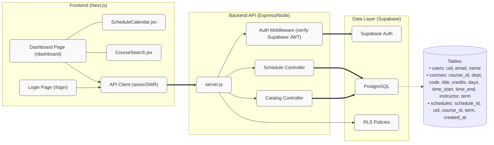

```mermaid
flowchart LR
  %% Style
  classDef box fill:#f9f9f9,stroke:#555,stroke-width:1px,rx:6,ry:6,color:#333333;

  subgraph FE["Frontend (Next.js)"]
    FE_Login["Login Page (/login)"]:::box
    FE_Dashboard["Dashboard Page (/dashboard)"]:::box
    FE_Calendar["ScheduleCalendar.jsx"]:::box
    FE_Search["CourseSearch.jsx"]:::box
    FE_API["API Client (axios/SWR)"]:::box
    FE_Dashboard --- FE_Calendar
    FE_Dashboard --- FE_Search
  end

  subgraph BE["Backend API (Express/Node)"]
    BE_Server["server.js"]:::box
    BE_AuthMW["Auth Middleware (verify Supabase JWT)"]:::box
    BE_Catalog["Catalog Controller"]:::box
    BE_Schedule["Schedule Controller"]:::box
    BE_Server --> BE_AuthMW
    BE_Server --> BE_Catalog
    BE_Server --> BE_Schedule
  end

  subgraph DB["Data Layer (Supabase)"]
    DB_Auth["Supabase Auth"]:::box
    DB_SQL["PostgreSQL"]:::box
    DB_RLS["RLS Policies"]:::box
  end

  %% Edges
  FE_Login --> FE_API
  FE_Dashboard --> FE_API
  FE_API ==> BE_Server

  BE_AuthMW ==> DB_Auth
  BE_Catalog ==> DB_SQL
  BE_Schedule ==> DB_SQL
  BE_Server --> DB_RLS

  %% Note
  DB_SQL -.-> noteDB[("Tables:\n• users: uid, email, name\n• courses: course_id, dept, code, title, credits, days, time_start, time_end, instructor, term\n• schedules: schedule_id, uid, course_id, term, created_at")]
```