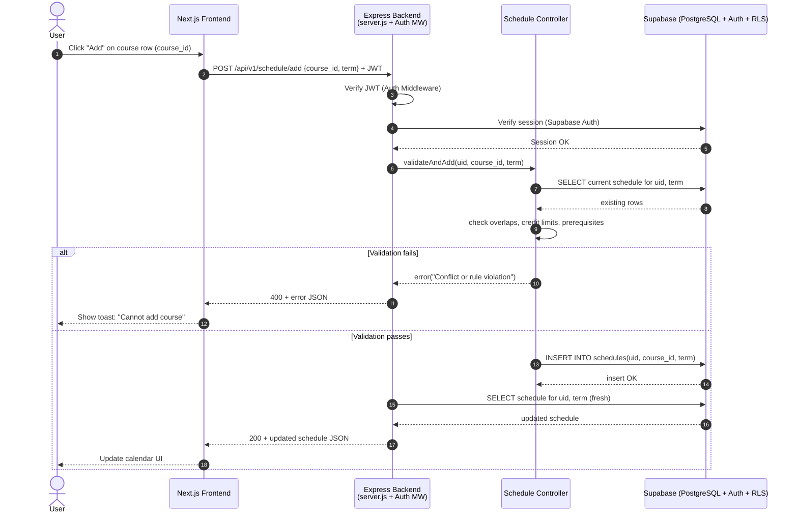

```mermaid
sequenceDiagram
  autonumber
  actor U as User
  participant FE as Next.js Frontend
  participant BE as Express Backend<br/>(server.js + Auth MW)
  participant SC as Schedule Controller
  participant DB as Supabase (PostgreSQL + Auth + RLS)

  U->>FE: Click "Add" on course row (course_id)
  FE->>BE: POST /api/v1/schedule/add {course_id, term} + JWT
  BE->>BE: Verify JWT (Auth Middleware)
  BE->>DB: Verify session (Supabase Auth)
  DB-->>BE: Session OK

  BE->>SC: validateAndAdd(uid, course_id, term)
  SC->>DB: SELECT current schedule for uid, term
  DB-->>SC: existing rows

  SC->>SC: check overlaps, credit limits, prerequisites
  alt Validation fails
    SC-->>BE: error("Conflict or rule violation")
    BE-->>FE: 400 + error JSON
    FE-->>U: Show toast: "Cannot add course"
  else Validation passes
    SC->>DB: INSERT INTO schedules(uid, course_id, term)
    DB-->>SC: insert OK
    BE->>DB: SELECT schedule for uid, term (fresh)
    DB-->>BE: updated schedule
    BE-->>FE: 200 + updated schedule JSON
    FE-->>U: Update calendar UI
  end
```