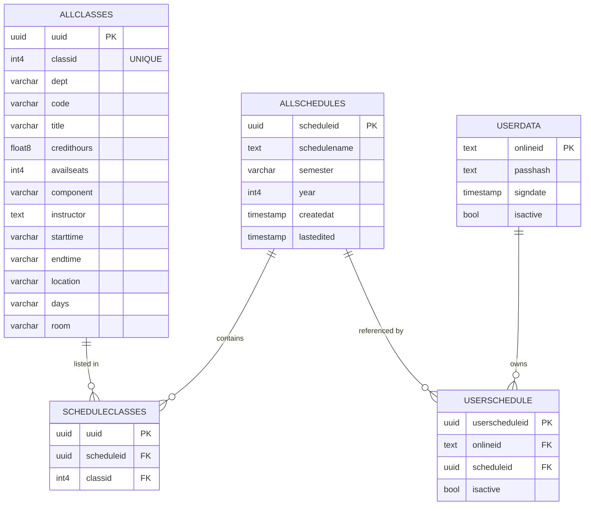

```mermaid
erDiagram
  ALLCLASSES {
    uuid uuid PK
    int4 classid "UNIQUE"
    varchar dept
    varchar code
    varchar title
    float8 credithours
    int4 availseats
    varchar component
    text instructor
    varchar starttime
    varchar endtime
    varchar location
    varchar days
    varchar room
  }

  ALLSCHEDULES {
    uuid scheduleid PK
    text schedulename
    varchar semester
    int4 year
    timestamp createdat
    timestamp lastedited
  }

  SCHEDULECLASSES {
    uuid uuid PK
    uuid scheduleid FK
    int4 classid FK
  }

  USERDATA {
    text onlineid PK
    text passhash
    timestamp signdate
    bool isactive
  }

  USERSCHEDULE {
    uuid userscheduleid PK
    text onlineid FK
    uuid scheduleid FK
    bool isactive
  }

  %% Relationships
  ALLSCHEDULES ||--o{ SCHEDULECLASSES : "contains"
  ALLCLASSES   ||--o{ SCHEDULECLASSES : "listed in"
  USERDATA     ||--o{ USERSCHEDULE    : "owns"
  ALLSCHEDULES ||--o{ USERSCHEDULE    : "referenced by"
```