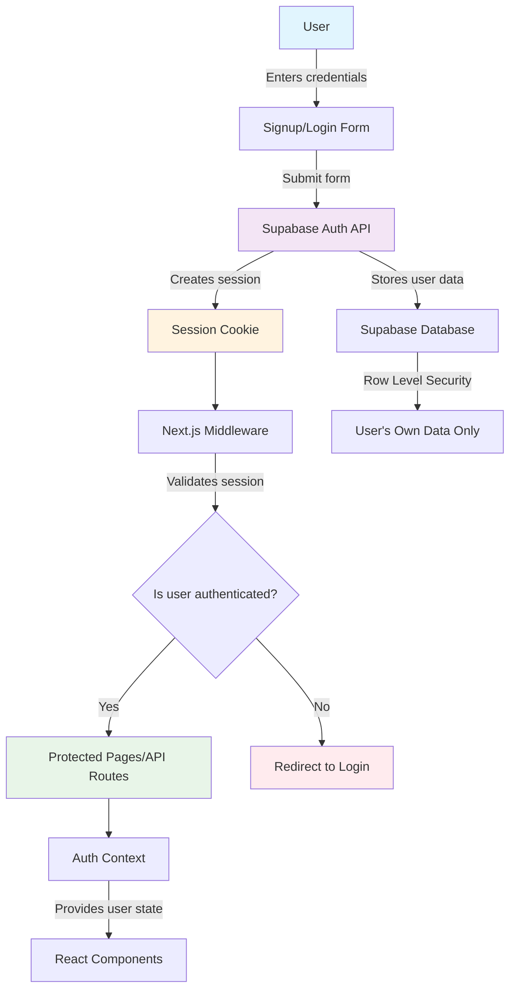

# Supabase Authentication: High-Level Overview

This project uses Supabase to handle user authentication in a modern, secure, and scalable way. Here’s how it works at a high level:

---

## 1. **User Signup & Login**
- Users sign up or log in using their email and password.
- The frontend calls Supabase’s authentication API to create or verify accounts.
- Supabase manages user accounts, password security, and email confirmations automatically.

---

## 2. **Session Management**
- When a user logs in, Supabase creates a session and stores it in a secure cookie.
- The session is automatically refreshed and managed by Supabase and Next.js middleware.
- The app uses this session to identify the user for all requests.

---

## 3. **Protected Routes & API Endpoints**
- Pages like `/builder` and API routes check if the user is authenticated before allowing access.
- If not logged in, users are redirected to the login page.
- API routes use the Supabase server client to get the current user and only allow actions for authenticated users.

---

## 4. **Auth Context for React Components**
- The app uses a React context (`AuthContext`) to provide user info and authentication state to all components.
- Components can easily check if a user is logged in, show user info, or trigger logout.

---

## 5. **Database Security (Row Level Security)**
- All user data in the database is protected with Row Level Security (RLS).
- Only the authenticated user can access or modify their own data.
- RLS policies are enforced automatically by Supabase.

---

## 6. **Email Confirmation & Password Reset**
- Supabase can send email confirmations and password reset links automatically.
- These flows are handled by Supabase, so you don’t need to build them yourself.

---

## 7. **Easy Integration & Maintenance**
- All authentication logic is handled by Supabase and a few simple React hooks and API calls.
- No need to manage passwords, sessions, or security details yourself.
- The system is easy to extend with social login, multi-factor auth, etc.

---

## **Summary Diagram**

---

**Result:**
- Secure, scalable authentication
- Minimal custom code
- Easy to maintain and extend
